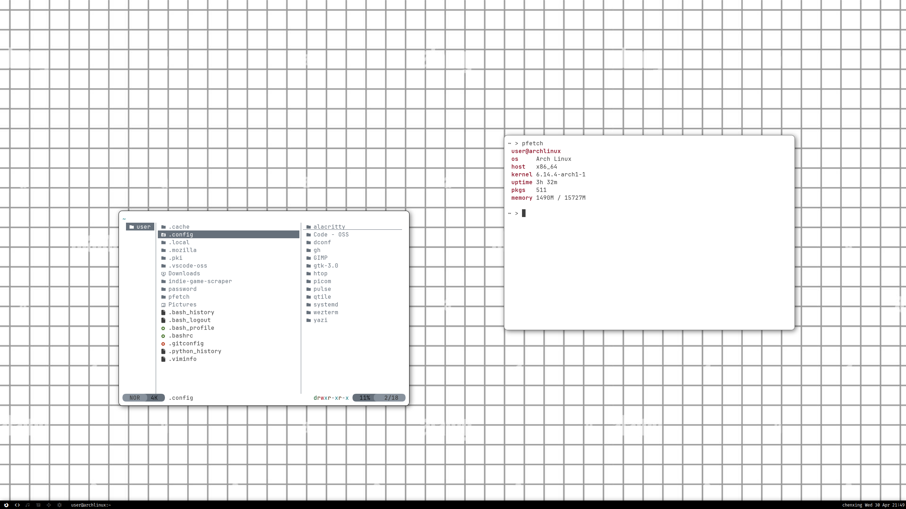

  

## Overview

a dotfiles repository for Arch Linux using GNU Stow, with an automated setup script and `archinstall` configuration.  

- 🖥️ **Archinstall configuration**
- 🧩 **Modular organization** with GNU Stow
- ⚡ **One-command deployment** for all or selected packages
- 🔄 **Safe backups** before making changes

## Repository Structure

```bash
dotfiles/
├── packages/          # GNU Stow-compatible directories
│   ├── qtile/.config/qtile/ # Qtile window manager config
│   ├── picom/.config/picom/ # Picom compositor config
│   ├── wezterm/.config/wezterm/ # Wezterm terminal config
│   └── ...                 # Add your own configs here
├── scripts/
│   └── setup.sh             # Dotfiles deployment script
├── config.json              # archinstall configuration
└── README.md                # This documentation
```

## Installation

### Arch Linux Installation

1. **Prepare installation media**:  
   Download Arch ISO from [archlinux.org](https://archlinux.org/download/)

2. **Boot into live environment**

3. **Run archinstall with [preset config](https://chenxing-dev.github.io/dotfiles/config.json)**:
   ```bash
   archinstall --config https://chenxing-dev.github.io/dotfiles/config.json
   ```

### Dotfiles setup

4. **Clone the repository**:
   ```bash
   git clone https://github.com/chenxing-dev/dotfiles.git ~/dotfiles
   ```

5. **Run the setup script**:
   ```bash
   cd ~/dotfiles
   ./scripts/setup.sh --all
   ```
   Reboot.

## Usage

### Deployment Options

```bash
# Deploy all configurations
./scripts/setup.sh --all

# Deploy specific packages
./scripts/setup.sh qtile wezterm yazi
```

### Adding New Configurations

1. Create a new package structure:
   ```bash
   mkdir -p packages/newtool/.config/newtool
   ```

2. Add your configuration files:
   ```bash
   cp ~/.config/newtool/config.toml packages/newtool/.config/newtool/
   ```

3. Deploy:
   ```bash
   ./scripts/setup.sh newtool
   ```

### **Backup restoration**:

   ```bash
   # View available backups
   ls ~/dotfiles_backup
   
   # Restore a package
   cp -r ~/dotfiles_backup/qtile_20240611_1420/* ~/
   ```

## Troubleshooting

### Ensure ~/.local/bin is in PATH

For bash users:
```bash
echo 'export PATH="$HOME/.local/bin:$PATH"' >> ~/.bashrc
source ~/.bashrc
```

## Contributing

Contributions are welcome! Please follow these steps:

1. Fork the repository
2. Create a feature branch (`git checkout -b new-feature`)
3. Commit your changes
4. Push to the branch
5. Open a pull request

## Credits
- Firefox Theme: [Monochrome Neubrutalism by Kaskapa](https://github.com/Kaskapa/Monochrome-Neubrutalism-Firefox-Theme)

## License

This project is licensed under the MIT License - see the [LICENSE](LICENSE) file for details.
