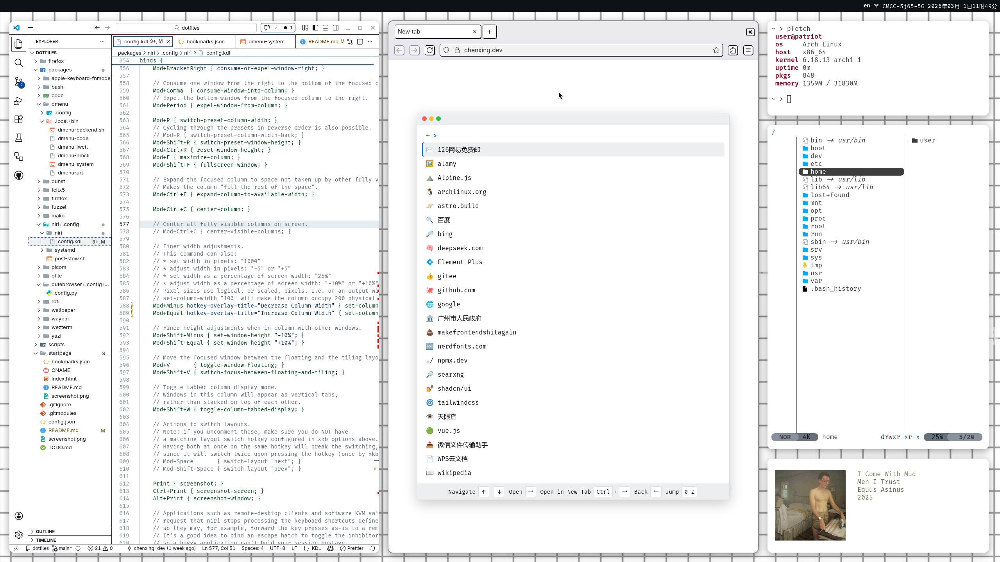

  

## Overview

a dotfiles repository for Arch Linux using GNU Stow, with an automated setup script.  


- 🧩 **Modular organization** with GNU Stow
- 🔄 **Safe backups** before making changes
- 🖥️ **Archinstall configuration** (DEPRECATED!)

## Repository Structure

```bash
dotfiles/
├── packages/                    # GNU Stow-compatible directories
│   ├── dmenu/                   # Rofi/Fuzzel dmenu-style scripts
│   ├── niri/.config/            # Niri window manager config
│   ├── picom/.config/picom/     # Picom compositor config
│   ├── qtile/.config/qtile/     # Qtile window manager config
│   ├── waybar/.config/waybar/   # Waybar status bar config
│   ├── wezterm/.config/wezterm/ # Wezterm terminal config
│   └── ...                      # More packages
├── config.json                  # archinstall config (deprecated)
├── README.md                    # This documentation
└── setup                        # Dotfiles deployment script

```

## Installation

### Arch Linux Installation

1. **Prepare installation media**:  
   Download Arch ISO from [archlinux.org](https://archlinux.org/download/)

2. **Boot into live environment**

3. **Run archinstall**:
   ```bash
   archinstall
   ```

### Dotfiles setup

4. **Clone the repository (including submodules)**:
   ```bash
   git clone --recurse-submodules https://github.com/chenxing-dev/dotfiles.git ~/dotfiles
   ```

   If you encounter `bash: git: command not found`, you can install Git using the following command:
   ```bash
   pacman -S git
   ```

   If you have already cloned the repository without the `--recurse-submodules` flag, you can initialize and update the submodules with:
   ```bash
   cd ~/dotfiles
   git submodule update --init --recursive
   ```

   If you are in the region in China and encounter issues with cloning, note that the repository is mirrored on Gitee: [https://gitee.com/dev-chenxing/dotfiles](https://gitee.com/dev-chenxing/dotfiles)

5. **Run the setup script**:

   List available packages with:

   ```bash
   cd ~/dotfiles
   ./setup
   ```

   Select the packages you want to deploy. 
   ```bash
   ./setup bash code dmenu fcitx5 firefox fuzzel mako niri wallpaper waybar wezterm yazi
   ```
   Reboot.

## Usage

### **Backup restoration**:

   ```bash
   # View available backups
   ls ~/dotfiles_backup
   
   # Restore a package
   cp -r ~/dotfiles_backup/qtile_20240611_1420/* ~/
   ```

## Troubleshooting

### Ensure ~/.local/bin is in PATH

For bash users:
```bash
echo 'export PATH="$HOME/.local/bin:$PATH"' >> ~/.bashrc
source ~/.bashrc
```

### Updating Submodules

To update submodules to their latest commits:
```bash
git submodule update --remote --recursive
```

## Contributing

Contributions are welcome! Please follow these steps:

1. Fork the repository
2. Create a feature branch (`git checkout -b new-feature`)
3. Commit your changes
4. Push to the branch
5. Open a pull request

## Credits
- Firefox Theme: [Monochrome Neubrutalism by Kaskapa](https://github.com/Kaskapa/Monochrome-Neubrutalism-Firefox-Theme)

## License

This project is licensed under the MIT License - see the [LICENSE](LICENSE) file for details.
